# dump1090-fa Mictronics

This is a fork of [dump1090-fa](https://github.com/flightaware/dump1090)
customized for use within [FlightAware](http://flightaware.com)'s
[PiAware](http://flightaware.com/adsb/piaware) software.

## Modifications:

* Aircraft metadata stored in browsers indexed database can be modified through web form.
* Added new map controls to maximise space for plane list and better handling on mobile devices.
* Use GNU Argp for program help.
* Added support for local connected Mode-S Beast via USB.
* Added application manifest, HD icon and favicon. That allows to install dump1090-fa on home screen of a mobile
  device and run as a standalone web application.
  Icon source https://pixabay.com/en/airplane-aircraft-plane-sky-flying-34786/ Released under Creative Commons CC0. 
* Hover label over aircrafts on map. Mod by Al Kissack. See https://github.com/alkissack/Dump1090-OpenLayers3-html
* Additional map layers. Mod by Al Kissack.
* Allow highlighting of filtered aircrafts instead of removing them from list.
* Added advanced filter option using VRS style menu.
* Use already included jQuery-UI to make space saving sidebar for maximum aircraft list.
* Link columns removed in aircraft table.
* Additional column to indicate civil or military aircraft (requires special database).
* Additional row color alert in case of interesting aircraft (requires special database).
* Detailed aircraft model in selected block (requires special database).
* Additional special squawks used in Germany. (Rettungshubschrauber, Bundespolizei etc.)
* Additional aircraft operator database. Aircraft operator will be shown in selected block
  and as flight ident tooltip in table.
* Added basic support for feeding a single push server like VRS
* Fixed memory leaks on exit
* Optimized structure memory layout for minimum padding.

:exclamation: **This branch is using browsers indexed database for aircraft meta data storage. The database
is loaded from server on version change, when empty or doesn't exists.**

**Your browser may not support indexed database if it's disabled or you are browsing in private mode.
To enable support in Firefox: Open URL 'about:config' search 'dom.indexedDB.enabled' set to 'true'.**

Tested in:
- Firefox v53 (Win7)
- Firefox v45.7 ESR (Debian)
- Chrome v59.0 (Debian)
- Chrome v58.0 (Android)
- Android Browser v4.0.30
- GNU IceCat v45.6 (Android)

*Note: In Android pre-loading the database takes a minute or two, so be patient. Don't stop the script.*

To speed up JSON loading you may add "application/json" to compress.filetype in /etc/lighttpd/lighttpd.conf:
`compress.filetype = ( "application/javascript", "text/css", "text/html", "text/plain", "application/json" )`
Don't forget to restart lighttpd or force-reload the configuration.

## Screenshots

<table>
    <tr>
        <td>
            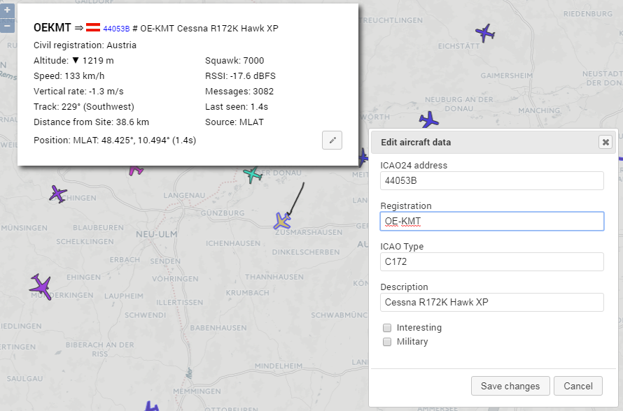 
            Edit existing aircraft metadata
        </td>
        <td>
            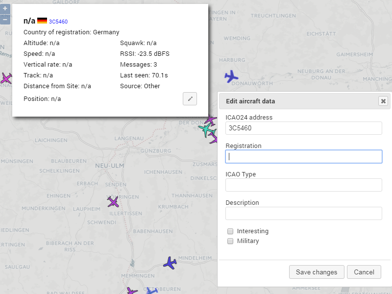 
            Add unknown aircraft metadata.
        </td>
    </tr>
    <tr>
        <td>
            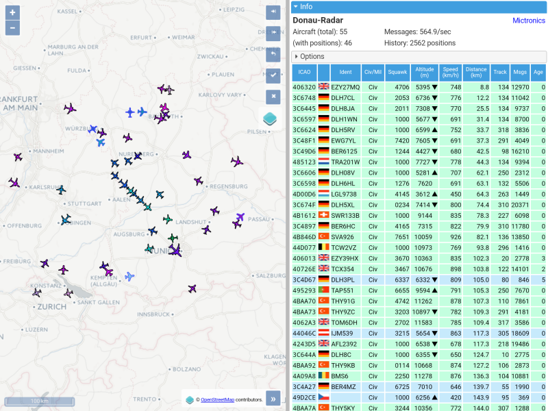
        </td>
        <td>Screeshot from Android tablet running dump1090-fa as standalone web application.</td>
    </tr>
    <tr>
        <td>
            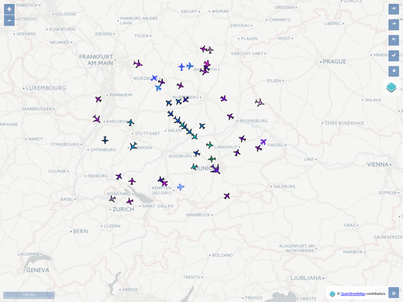
        </td>
        <td>
            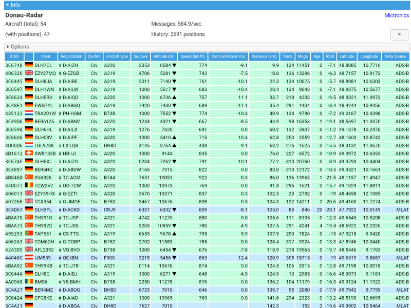
        </td>
    </tr>
    <tr>
        <td>
            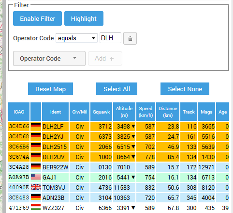
        </td>
        <td>
            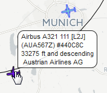
        </td>
    </tr>
    <tr>
        <td>
            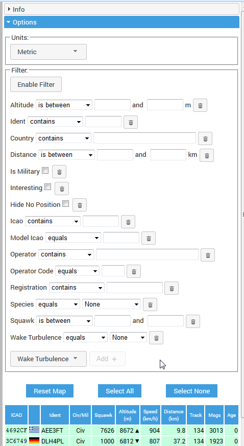
        </td>
        <td>
            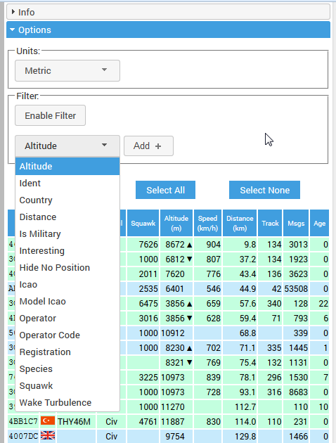
        </td>
    </tr>
    <tr>
        <td>
            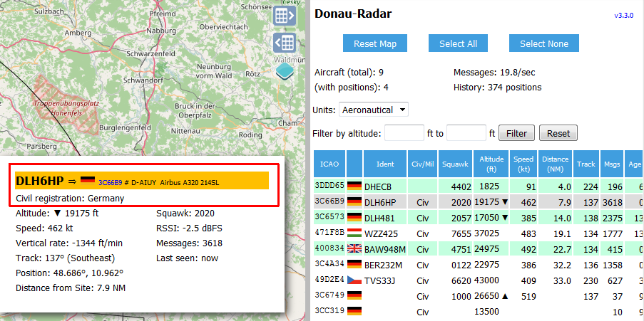
        </td>
        <td>
            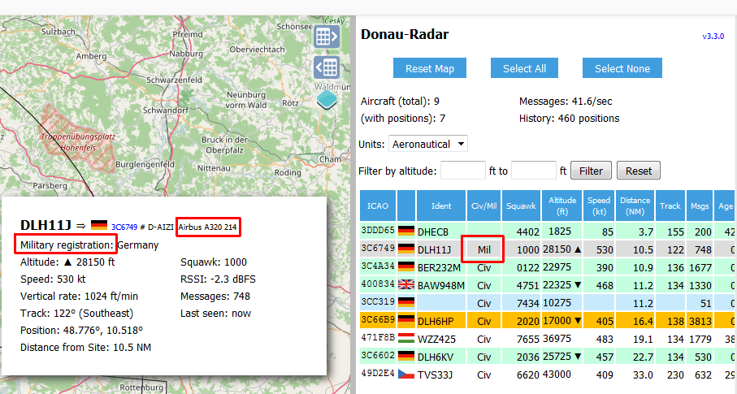
        </td>
    </tr>
    <tr>
        <td>
            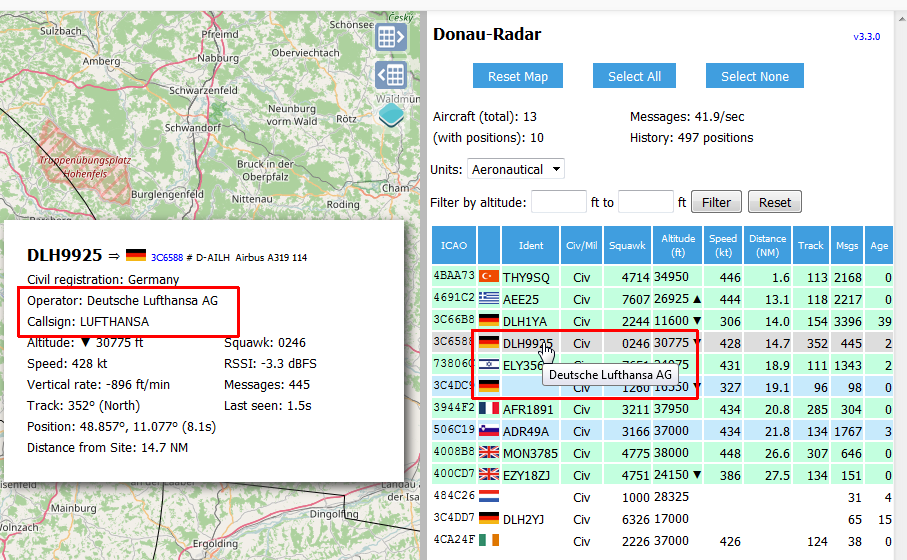
        </td>
        <td>
            
        </td>
    </tr>
    <tr>
        <td>
            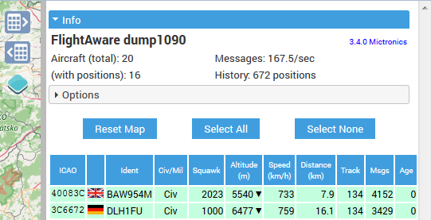
        </td>
        <td>
            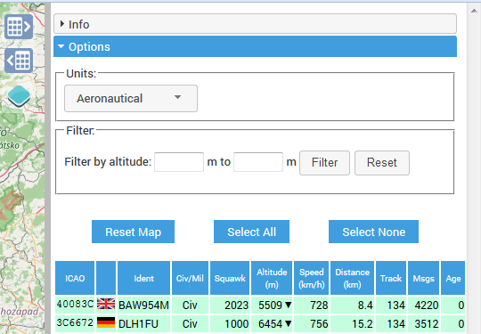
        </td>
    </tr>
    <tr>
        <td>
            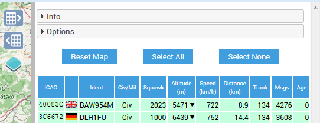
        </td>
        <td>
            
        </td>
    </tr>
    <tr>
        <td>
            
        </td>
        <td>
            
        </td>
    </tr>
</table>

## Push server support

dump1090-fa tries to connect to a listening server, like a VRS push server.

For example feeding VRS at adsbexchange.com use the new parameters:
--net-push-address feed.adsbexchange.com --net-push-port 30005 --net-push-beast

## dump1090-fa Debian/Raspbian packages

It is designed to build as a Debian package.

## Building under jessie

### Dependencies - bladeRF

You will need a build of libbladeRF. You can build packages from source:

$ git clone https://github.com/Nuand/bladeRF.git
$ cd bladeRF
$ dpkg-buildpackage -b

Or Nuand has some build/install instructions including an Ubuntu PPA
at https://github.com/Nuand/bladeRF/wiki/Getting-Started:-Linux

Or FlightAware provides armhf packages as part of the piaware repository;
see https://flightaware.com/adsb/piaware/install

### Dependencies - rtlsdr

This is packaged with jessie. "sudo apt-get install librtlsdr-dev"

### Actually building it

Nothing special, just build it ("dpkg-buildpackage -b")

## Building under wheezy

First run "prepare-wheezy-tree.sh". This will create a package tree in
package-wheezy/. Build in there ("dpkg-buildpackage -b")

The wheezy build does not include bladeRF support.

## Building manually

You can probably just run "make" after installing the required dependencies.
Binaries are built in the source directory; you will need to arrange to
install them (and a method for starting them) yourself.

"make BLADERF=no" will disable bladeRF support and remove the dependency on
libbladeRF.

"make RTLSDR=no" will disable rtl-sdr support and remove the dependency on
librtlsdr.
